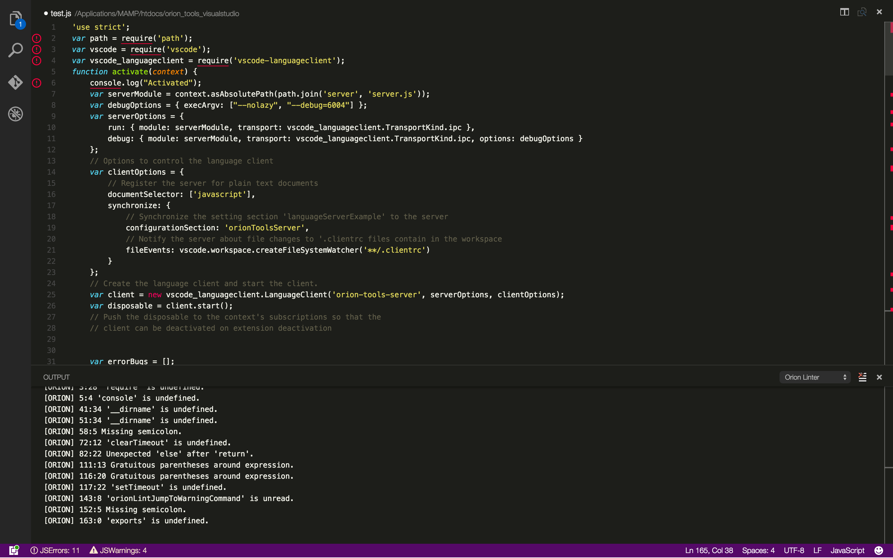

# Orion Tools For Visual Studio 
A collection of plugins that provide Orion tools for Visual Studio.

### Install Orion Linter ###
1. Clone the repo and change current directory to it.
2. Run `npm install` at `./` level and the `./server` level to get necessary dependencies.
3. Run `code .` at `./` level to use vscode to open the project.
4. Press `F5` and the linter is loaded in the pop up "Extenion Host" window.

### Screenshot ###

